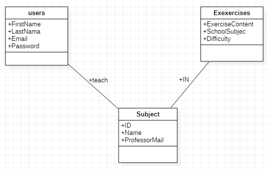
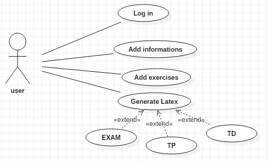
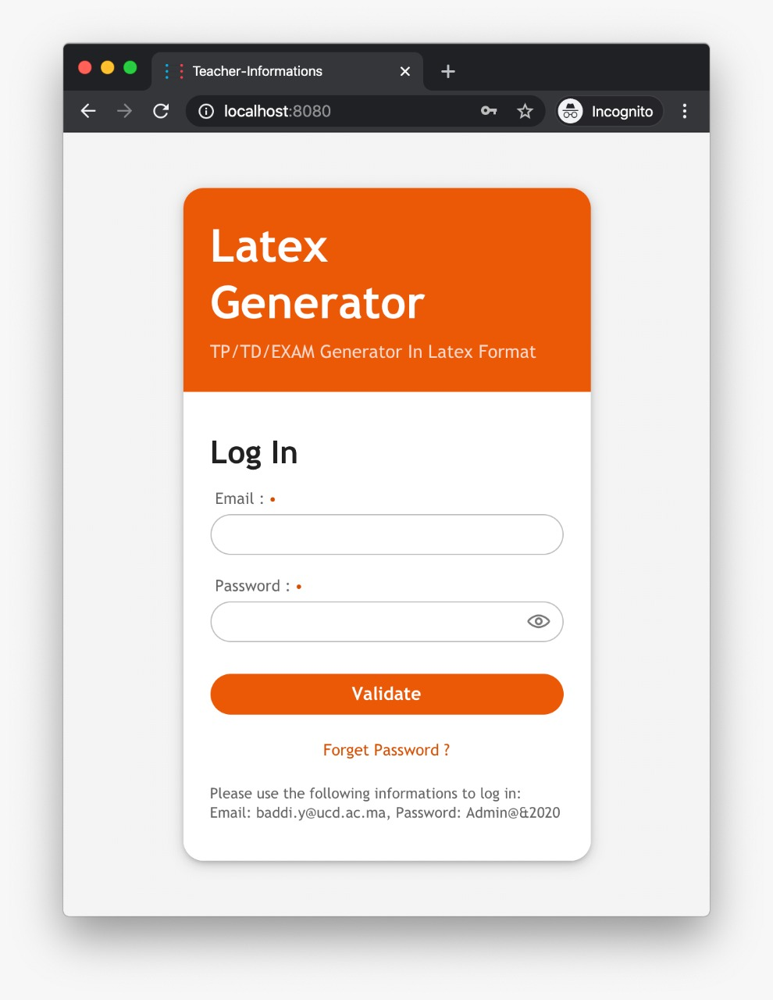
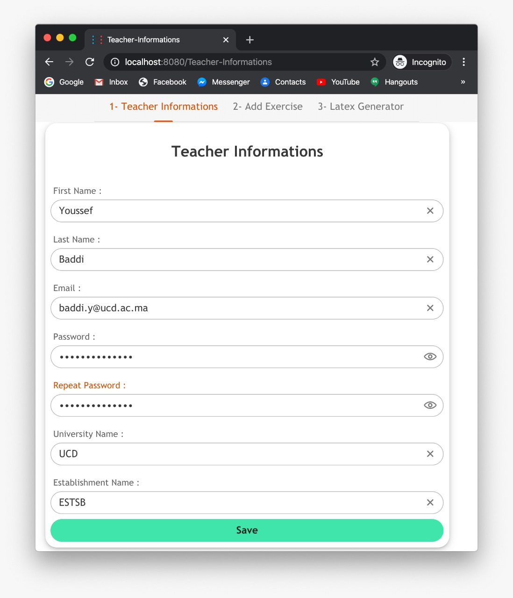
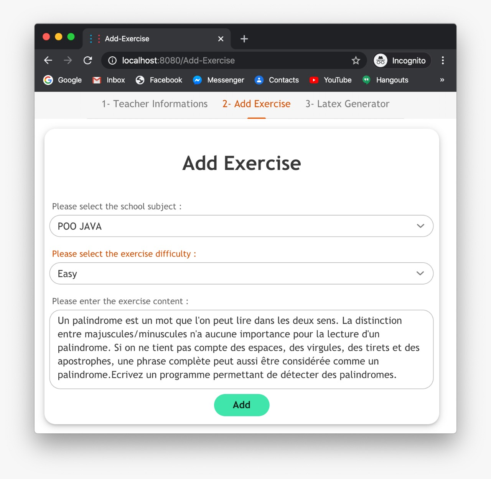
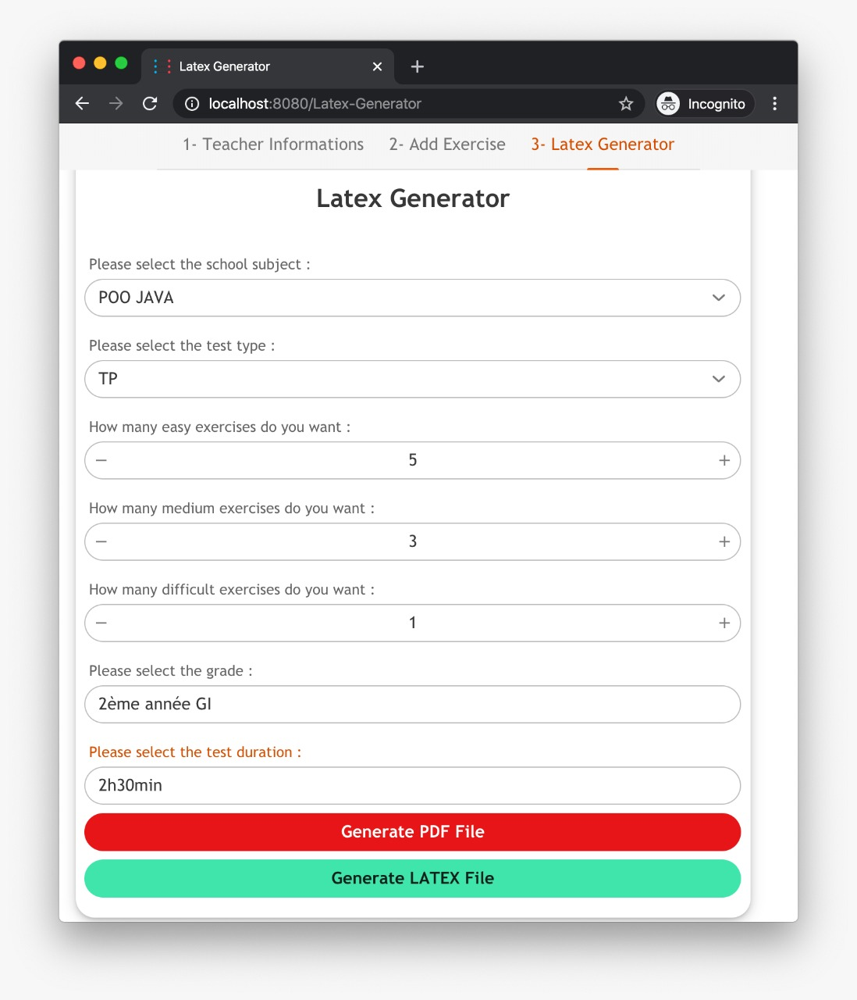
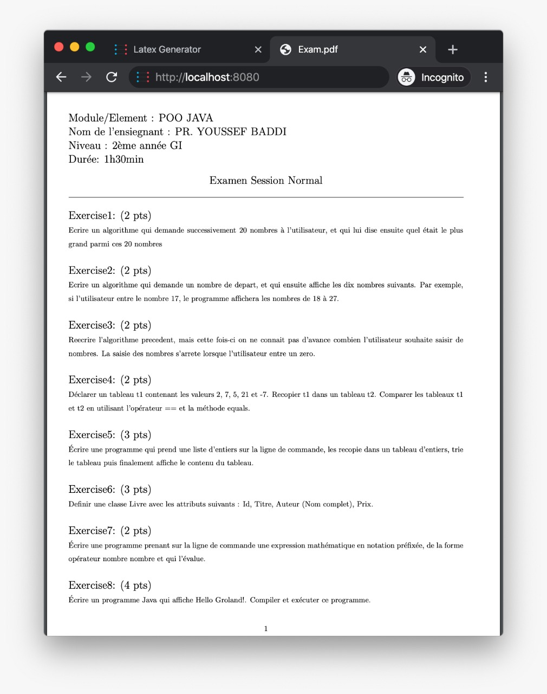

# Latex-Generator
> A Java web application to generate EXAM/TP/TD in LATEX format


## Project Presentation
This project is a Latex Generator that its specially role is to generate an EXAM or TP or TD for a professor , To make his tasks less difficult and more effective to win time and organize work.
Also, the professor can add the exercises in database as he likes, he just need to select the subject and the level then the body of the exercise.
## Built With

* [Vaadin](https://vaadin.com)
* [MongoDB](https://mongodb.com)
* [Jackson](https://github.com/FasterXML/jackson-core)
* [Jetty](https://www.eclipse.org/jetty)
* [Maven](https://maven.apache.org)

## Design & Analysis (UML)

> Class Diagram :<br>


> Use Case Diagram :<br>


 ---
## Prerequisites

- Install maven :
> On MAC OS using [Homebrew](https://brew.sh/) :
```shell
brew install maven
```
> On Linux (Ubuntu) :
```shell
sudo apt install maven
```
> On Windows using [Chocolatey](https://chocolatey.org/) :
```shell
choco install maven
```
- Configure MongoDB server :
```java
package com.latex.generator.backend;

import com.mongodb.MongoClient;
import com.mongodb.MongoClientURI;
import com.mongodb.client.MongoDatabase;

public class Database {
    public static MongoDatabase db = null;

    public static void connect() {
        int portNumber = 27017;
        String hostName = "localhost", databaseName = "LatexGenerator";
        String client_url = "mongodb://" + hostName + ":" + portNumber + "/" + databaseName;
        MongoClientURI uri = new MongoClientURI(client_url);
        MongoClient mongo_client = new MongoClient(uri);
        db = mongo_client.getDatabase(databaseName);
        while (db == null) ;
    }
}
```
- Create Database & Collections :
```bash
use LatexGenerator

db.Users.insert({
    "FirstName" : "Youssef",
    "LastName" : "Baddi",
    "Email" : "baddi.y@ucd.ac.ma",
    "Password" : "7dd6d2220b0c9be4da3a4967c4af7aa4",
    "UniversityName" : "UCD",
    "EstablishmentName" : "ESTSB",
})

db.Subjects.insert({
    "Email" : "baddi.y@ucd.ac.ma",
    "Name" : "POO JAVA"
})
```
## How to run it

```bash
mvn jetty:run
```
---
## Screenshots
>Login :


>Create an account :


>Add an exercise :


>Generate Latex or PDF file :


>Example of a generated exam :


---

## Contributing

Contributions are what make the open source community such an amazing place to be learn, inspire, and create. Any contributions you make are **greatly appreciated**.

1. Fork the Project
2. Create your Feature Branch (`git checkout -b feature/AmazingFeature`)
3. Commit your Changes (`git commit -m 'Add some AmazingFeature'`)
4. Push to the Branch (`git push origin feature/AmazingFeature`)
5. Open a Pull Request

## License
[MIT License](https://choosealicense.com/licenses/mit/)

## Thanks 
:pray: Finally, we want say thank you to the one and only, our teacher [Mr BADDI YOUSSEF](https://linkedin.com/in/youssefbaddi) Assistant Doctor in UCD (CHOUAIB DOUKKALI University, ElJadida, Moroco) for his supervising and supporting, also for giving us this opportunity to improve our skills and know new technologies.

## Contact
- Imane Lahlou - [imanelahlou2000@gmail.com](mailto:imanelahlou2000@gmail.com)
- Khaoula El Majni - [elmajnikhaoula99@gmail.com](mailto:elmajnikhaoula99@gmail.com)
- Yassine Lafryhi - [y.lafryhi@gmail.com](mailto:y.lafryhi@gmail.com)
- Project Link : [https://github.com/Yassine-Lafryhi/Latex-Generator](https://github.com/Yassine-Lafryhi/Latex-Generator)
